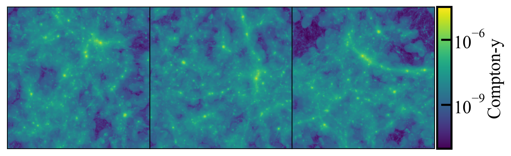

Maps and Pre-Made Data Products
===============================

The RAFIKI-CGM data products consist of: 

- Maps of the Compton-y parameter projected along the x, y, and z simulation box axis.
- Event files containing projected X-ray photon data 
- Galaxy catalogs containing galaxy and halo properties. 

.. _comptony-maps:

Compton-y Maps
--------------

For each simulation snapshot, a 2D map of the Compton-y parameter is generated. The maps are generated using yt's fixed resolution buffer 
(FRB) functionality, such that each pixel has a width corresponding to 3 arcseconds at the redshift of the snapshot. (If you generate your own
map, be sure to update ``sz.pixel_size_arcsec`` in the configuration file).

    Compton-y maps that come with RAFIKI-CGM. Here we see the RAFIKI-A simulation at z=1, projected in the x (left), y (center), and z (right) directions. To generate data products,
    stamps will be cut out of these maps around galaxies in the identified sample and stacked to generate a range of data products. 

.. _event_files:

Event Files
-----------

For a complete explanation of the event file structure and use, see `the pyXSIM documentation <https://hea-www.cfa.harvard.edu/~jzuhone/pyxsim/photon_lists/event_lists.html>`_ 
Event files are generated for the 500 most massive galaxies in each simulation box, which generally corresponds to a stellar mass limit of 
4.2 x 10^10 solar. Lower-mass samples are planned for future RAFIKI-CGM releases. 

Galaxy Catalogs
---------------

Galaxy catalogs are saved as hdf5 files in the main directory for each simulation. 

**File structure:**

.. code-block:: none

    galaxy_catalog.hdf5.hdf
    ├── metadata/
    │   ├── simulation           
    │   └── redshift                
    │   
    ├── galaxy_properties/            
    │   ├── stellar_mass            
    │   ├── dm_mass              
    │   ├── m200c                   
    │   ├── r200c    
    │   ├── m500c                   
    │   ├── r500c  
    │   ├── age                  
    │   ├── sfr 
    │   └── central                  
    │
    ├── physical_locations/            
    │   ├── x            
    │   ├── y            
    │   └── z       
    │
    └──frb_locations/            
       ├── x            
       ├── y            
       └── z   

A variety of halo properties are saved to allow for the consideration of different methods of determining halo mass.

FRB locations refer to the pixel locations of the pre-made Compton-y parameter maps (see :ref:`comptony-maps`)