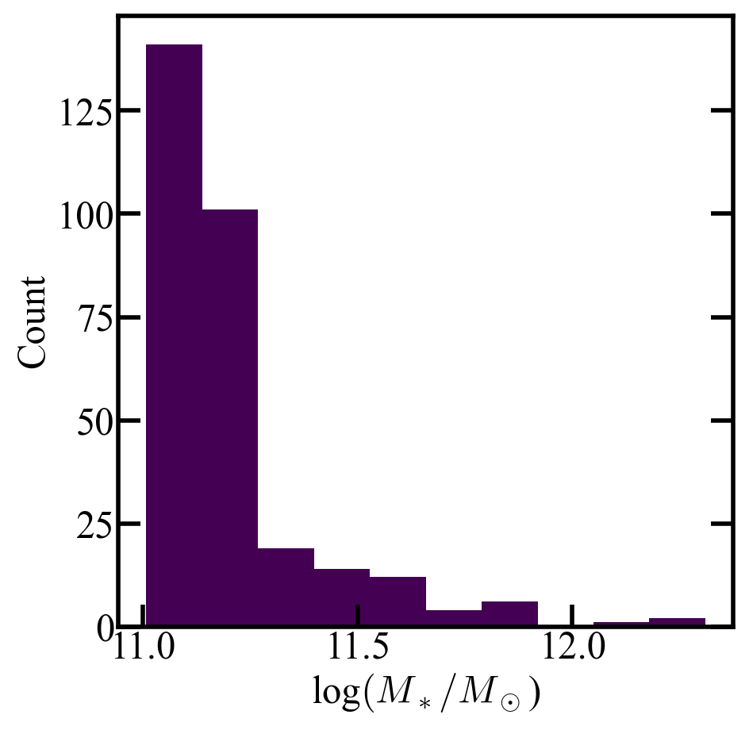
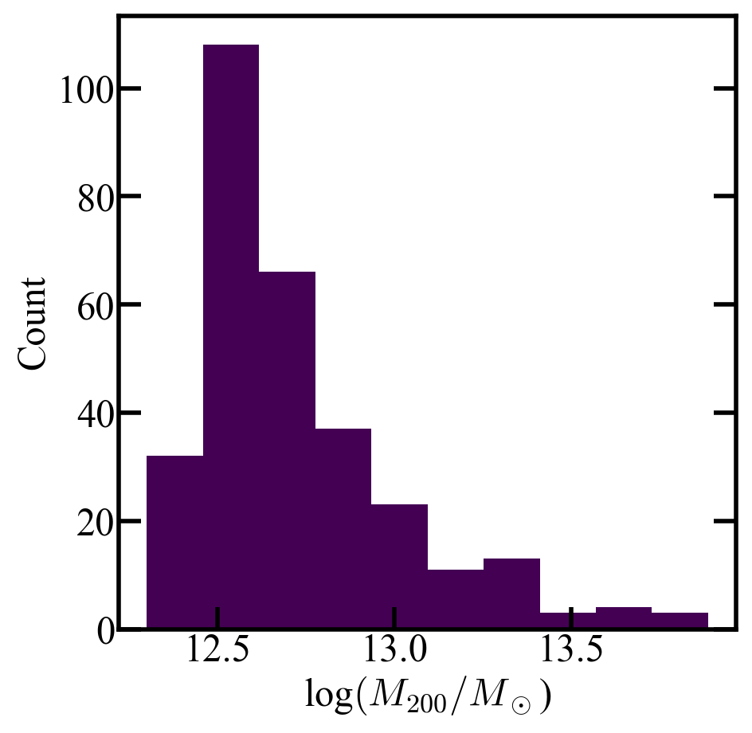
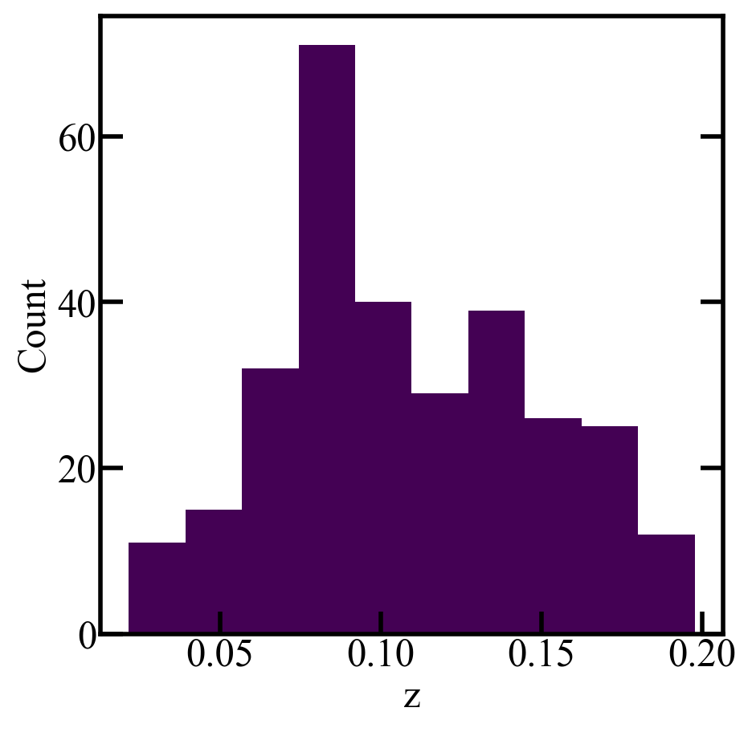
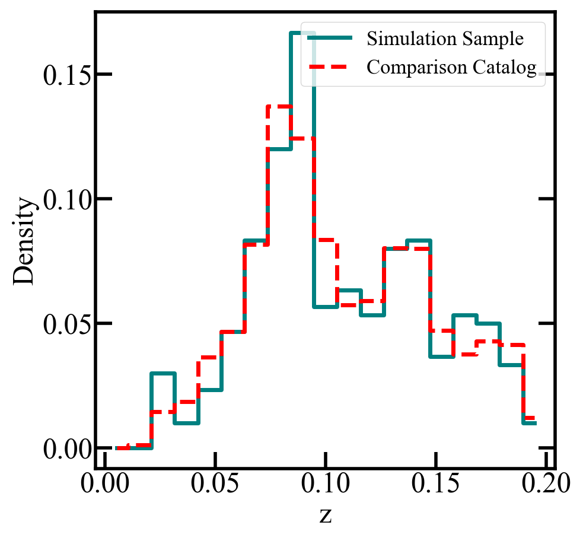

Exploring Your Galaxy Sample 
============================

After generating your stacked data, it will be useful to explore the properties of the chosen galaxy sample. The output data files include metadata/galaxy_indices, which provides the indices 
of the selected galaxies. These can be used in combination with the provided galaxy catalog files to access galaxy property information. In the example below, we explore the properties 
of the galaxy sample selected for the quickstart configuration. This involved matching galaxy stellar mass distribution against an observational catalog with a resampling count of N=300. More details on running the pipeline 
can be found at :doc:`quickstart`, and the routine below is available for download as a Jupyter notebook (``Galaxy_Sample_Analysis.ipynb``) in the examples directory on Github

.. note:: 
	The matching approach to galaxy sample selection includes random selection during the resampling process, so your galaxy sample may be slightly different than the example shown here. 

.. code-block:: python

    #-------------------------LOADING THE DATA-----------------------------#
    import numpy as np
    from matplotlib import pyplot as plt
    import pandas as pd
    import h5py
    from matplotlib.colors import LogNorm

    #------------LOAD GALAXY SAMPLE FROM OUTPUTS-------------------#
    data_file = 'outputs/quickstart_szdat.h5' #can use either the SZ or X-ray output file, they contain the same information
    with h5py.File(data_file, 'r') as f:
        sim_name = f['metadata'].attrs['simulation']
        redshift = f['metadata'].attrs['redshift']
        indices = f["metadata"]["galaxy_indices"][:]
        galaxy_redshifts = f["metadata"]["galaxy_redshifts"][:]

    #-------------LOAD GALAXY CATALOG-------------------#
    path_to_package_data = '/path/to/downloaded/dataproducts/' #Set the same as your configuration file

    red_shift = {'0.1':'0_1', '0.5':'0_5', '1':'1', '1.0':'1','2':'2','2.0':'2','1.':'1','2.':'2'} #To account for possible names
    if redshift not in red_shift:
        raise ValueError(f"Redshift '{redshift}' not recognized. Valid options are: 0.1, 0.5, 1, 2")

    path = path_to_package_data+sim_name+'/snap_z'+red_shift[redshift]+'/galaxy_catalog.hdf5'
    with h5py.File(path, 'r') as f:

        stell = f['galaxy_properties/stellar_mass'][:]
        dm_mass      = f['galaxy_properties/dm_mass'][:]
        m200c        = f['galaxy_properties/m200c'][:]
        r200c        = f['galaxy_properties/r200c'][:]
        halo       = f['galaxy_properties/m500c'][:]
        rad        = f['galaxy_properties/r500c'][:]
        age          = f['galaxy_properties/age'][:]
        sfr          = f['galaxy_properties/sfr'][:]
        central = f['galaxy_properties/central'][:]

    #------------PLOT GALAXY STELLAR MASS DISTRIBTUION--------------------#
    plt.hist(np.log10(stell)[indices])
    plt.ylabel('Count')
    plt.xlabel('log$(M_*/M_\odot$)')

.. code-block:: python

    #------------PLOT GALAXY HALO MASS DISTRIBTUION--------------------#
    plt.hist(np.log10(halo)[indices])
    plt.ylabel('Count')
    plt.xlabel('log$(M_{200}/M_\odot$)')

.. code-block:: python

    #------------PLOT GALAXY REDSHIFT DISTRIBTUION--------------------#
    plt.hist(galaxy_redshifts)
    plt.ylabel('Count')
    plt.xlabel('z')  

.. code-block:: python

    #------------COMPARE AGAINST OBSERVED REDSHIFT DISTRIBUTION------------#

    obs_catalog = '/path/to/downloaded/erosita_comparison.csv' #should match selection.redshift_sampling.observational_catalog in config file
    obs_redshifts   = np.array(pd.read_csv(obs_catalog))[:,1].astype(float)
    bins = np.linspace(0,0.2,num=20)
    obs_hist,bin_edges = np.histogram(obs_redshifts,bins=bins)
    obs_hist_norm =obs_hist/np.sum(obs_hist)
    sample_hist,bin_edges = np.histogram(galaxy_redshifts, bins=bins)
    sample_hist_norm =sample_hist/np.sum(sample_hist)

    bin_centers = 0.5 * (bin_edges[:-1] + bin_edges[1:])

    plt.step(bin_centers, sample_hist_norm, where='mid',
            color='teal', linestyle='-', linewidth=5,label='Simulation Sample')

    plt.step(bin_centers, obs_hist_norm, where='mid',
            color='red', linestyle='--', linewidth=5, label='Comparison Catalog')
    plt.legend(fontsize=25,loc='upper right')
    plt.xlabel('z')
    plt.ylabel('Density')
    plt.show()

