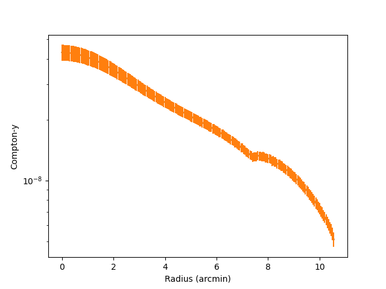
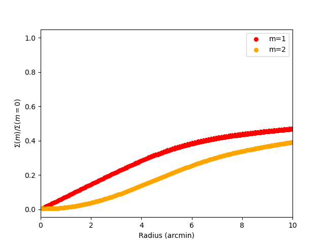
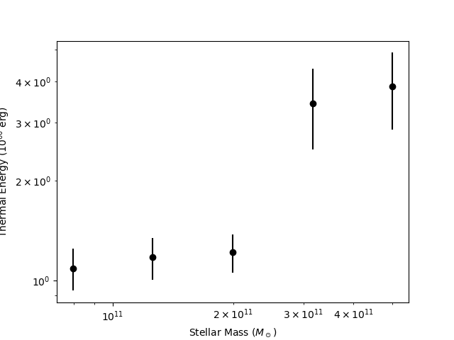
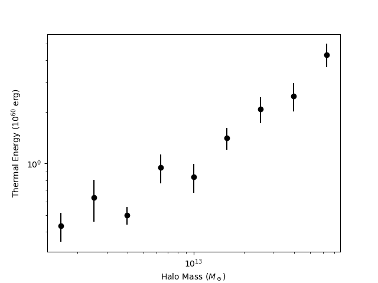
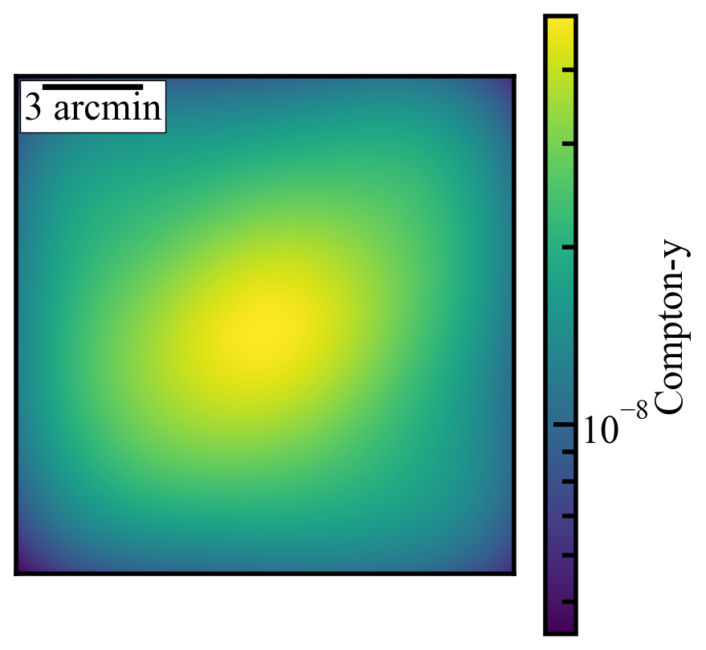

Running and Plotting Thermal Sunyaev Zel'dovich Data
======================================================

This cookbok walks through a basic end-to-end run of RAFIKI-CGM's tSZ functionality. 

Setting up the Config File
---------------------------

Copy the example config file into your directory.

    cp config_example.yaml config.yaml

Set the path to where you want the RAFIKI-CGM data products to be downloaded

.. code-block:: yaml

    package_data:
      path: /path/to/your/data/
      sim: RAFIKI_A
      redshift: 0.1

Choose all four tSZ analyses:

.. code-block:: yaml

    analysis:
        sz_radial_profiles: true        
        sz_moment_profiles: true     
        thermal_energy: true         
        sz_stacked_image: true        
        xray_profiles: false         
        xray_stacked_image: false  
        
Select your galaxy sample using a comparison catalog. In this example we place an initial cut on central massive galaxies with a stellar mass greater than 1e11 and halo masses between 1e12 and 1e14.
Then we resampling 300 times to generate a catalog that matches the distribution from erosita_comparison.csv, which can be found in the examples directory on github. This is also used to randomly 
assign redshifts to the galaxies. 

.. code-block:: yaml

	selection:
		method: matches              
		property_ranges:
            centrals_only: true             
			stellar_mass_min: 1e11  
			stellar_mass_max: null     
			halo_mass_min: 1e12       
			halo_mass_max: 1e14      
			ssfr_min: null            
			ssfr_max: null     
        catalog:
            path: ./erosita_comparison.csv            #Comparison catalog
            match_property: stellar_mass  #Options: stellar_mass | halo_mass    
            column: 0                    #Column index of match_property in catalog
            bins: [11, 11.05, 11.1, 11.15,11.2,11.25, 11.3]  #log10 solar masses
            n_sample: 300                 #Number of galaxies in resampled selection 
        #For assigning redshifts to each galaxy for mock observation
        redshift_sampling:
            mode:          redshift          #Options: fixed, redshift, mass_redshift
            fixed_z:       0.1            #Redshift for every galaxy (reccomended to use the snapshot redshift above)
            observational_catalog: ./erosita_comparison.csv        #If not using fixed, comparison catalog with sample z (if redshift mode) or sample z and mass if (mass_redshift mode)
            z_column: 1                   #Column index of redshift in catalog
            mass_column: 0                #Column index of stellar mass in catalog
            mass_bins:  [10.5,11,11.25,11.5,14]       

Select your SZ analysis parameters. In this situation we are using a beam standard deviation of 2 arcminutes. For thermal energy calculations we are summing within
nine arcminutes and stacking galaxies with the halo and stellar mass bins shown below. 

.. code-block:: yaml

	sz:
		pixel_size_arcsec: 3     
		stamp_width: 30          
		gaussian_std: 2
        radial_bins: [   0,   10,   20,   30,   40,   50,   60,   70,   80,   90,  100,
            110,  120,  130,  140,  150,  160,  170,  180,  190,  200,  210,
            220,  230,  240,  250,  260,  270,  280,  290,  300,  310,  320,
            330,  340,  350,  360,  370,  380,  390,  400,  410,  420,  430,
            440,  450,  460,  470,  480,  490,  500,  510,  520,  530,  540,
            550,  560,  570,  580,  590,  600,  610,  620,  630,  640,  650,
            660,  670,  680,  690,  700,  710,  720,  730,  740,  750,  760,
            770,  780,  790,  800,  810,  820,  830,  840,  850,  860,  870,
            880,  890,  900,  910,  920,  930,  940,  950,  960,  970,  980,
            990, 1000, 1010, 1020, 1030, 1040, 1050, 1060, 1070, 1080, 1090,
            1100, 1110, 1120, 1130, 1140, 1150, 1160, 1170, 1180, 1190, 1200,
            1210, 1220, 1230, 1240, 1250, 1260, 1270, 1280, 1290, 1300, 1310,
            1320, 1330, 1340, 1350, 1360, 1370, 1380, 1390, 1400, 1410, 1420,
            1430, 1440, 1450, 1460, 1470, 1480, 1490, 1500]             
		thermal_energy:            
			aperture: 9             
			stellar_mass_bins: [10.7, 10.9, 11.1, 11.3, 11.5, 11.7, 14.0]  
			halo_mass_bins: [12, 12.2, 12.4, 12.6, 12.8, 13, 13.2, 13.4, 13.6, 13.8, 16]

Point to where you want the data to save

.. code-block:: yaml

	# Output
	output:
		directory: ./results/      
		label: rafiki_A_example       

Running the Pipeline
--------------------

Run the pipeline from the command line

.. code-block:: bash
	
	rafiki --config config.yaml

You should see output like:

.. code-block:: none

    Number of selected analog galaxies: 300
    Beginnning radial profile analysis...
    Completed radial profile analysis.
    Beginnning moment profile analysis...
    Completed moment profile analysis.
    Beginning thermal energy analysis...
    Completed thermal energy analysis.
    Beginnning generating stacked image...
    Completed stacked image.
    Finished.

Remember that the number of selected galaxies is equal to three times the actual number in the simulation box as it accounts for the three different projections.

.. _plotting:

Loading and Plotting Your Results
----------------------------------

Once the pipeline has finished running you can load the output files and plot the radial profiles, moment radial profiles, thermal energy scaling relations, and the stacked Comtpon-y map as below

.. code-block:: python

    import numpy as np
    from matplotlib import pyplot as plt    
    import h5py

    data_file = 'results/rafiki_A_example_szdat.hdf5' #path to saved stacked radial data-should be the only thing you need to change

    #-------------RADIAL PROFILES-------------#
    with h5py.File(data_file, 'r') as f:
        x_a = f['radial_profile/radius'][:]
        y_a = f['radial_profile/compton-y'][:]
        err_a = f['radial_profile/error'][:]

    plt.plot(x_a,y_a)
    plt.errorbar(x_a,y_a, yerr=err_a)
    plt.xlabel('Radius (arcmin)')
    plt.ylabel('Compton-y')
    plt.yscale('log')
    plt.show()

.. code-block:: python

    #-------------MOMENT PROFILES-------------#
    with h5py.File(data_file, 'r') as f:
        x_a = f['moment_profiles/radius'][:]
        y_a = f['moment_profiles/moment_1'][:]
        err_a = f['moment_profiles/m1_error'][:]
        y_b = f['moment_profiles/moment_2'][:]
        err_b = f['moment_profiles/m2_error'][:]

    plt.scatter(x_a, y_a,s=30,color = 'red',label = 'm=1')
    plt.errorbar(x_a, y_a[0:300],yerr = err_a,color = 'red',fmt ='none')
    plt.scatter(x_a, y_b[0:300],s=30,color = 'orange',label = 'm=2')
    plt.errorbar(x_a, y_b[0:300],yerr = err_b,color = 'orange',fmt ='none')
    plt.legend()
    plt.xlim(0,10)
    plt.xlabel('Radius (arcmin)')
    plt.ylabel('$\Sigma(m)/\Sigma(m=0$)')
    plt.show()

.. code-block:: python

    #-------------STELLAR MASS-THERMAL ENERGY-------------#
    with h5py.File(data_file, 'r') as f:
        x_a = f['thermal_energy/stellar_mass'][:]
        y_a = f['thermal_energy/thermal_stellar'][:]
        err_a = f['thermal_energy/thermal_stellar_error'][:]

    plt.scatter(x_a ,y_a, c = 'black')
    plt.errorbar(x_a,y_a, yerr=err_a, fmt='none', color = 'black')
    plt.yscale('log')
    plt.xscale('log')
    plt.xlabel('Stellar Mass ($M_\odot$)')
    plt.ylabel('Thermal Energy ($10^{60}$ erg)')
    plt.show()

.. code-block:: python

    #-------------HALO MASS-THERMAL ENERGY-------------#
    with h5py.File(data_file, 'r') as f:
        x_a = f['thermal_energy/halo_mass'][:]
        y_a = f['thermal_energy/thermal_halo'][:]
        err_a = f['thermal_energy/thermal_halo_error'][:]

    plt.scatter(x_a ,y_a, c = 'black')
    plt.errorbar(x_a,y_a, yerr=err_a, fmt='none', color = 'black')
    plt.yscale('log')
    plt.xscale('log')
    plt.xlabel('Halo Mass ($M_\odot$)')
    plt.ylabel('Thermal Energy ($10^{60}$ erg)')
    plt.show()

.. code-block:: python

    #-------------STACKED IMAGE-------------#
    import matplotlib.colors as colors
    from mpl_toolkits.axes_grid1.anchored_artists import AnchoredSizeBar

    with h5py.File(data_file, 'r') as f:
        y_a = f['image/image_dat'][:]

    fig, ax = plt.subplots()

    plt.imshow(y_a, norm=colors.LogNorm(vmin=np.min(y_a), vmax=np.max(y_a)))
    plt.colorbar(label='Compton-y')
    ax.set_xticks([]) 
    ax.set_yticks([]) 
    ax.set_xlabel("")  
    ax.set_ylabel("")

    #Calculated pixel scale using default 1 pixel = 3 arcsec
    scalebar = AnchoredSizeBar(ax.transData,
                            60, '3 arcmin', 'upper left', 
                            pad=0.1,
                            color='black',
                            frameon=True,
                            size_vertical=3)

    ax.add_artist(scalebar)
    plt.show()

