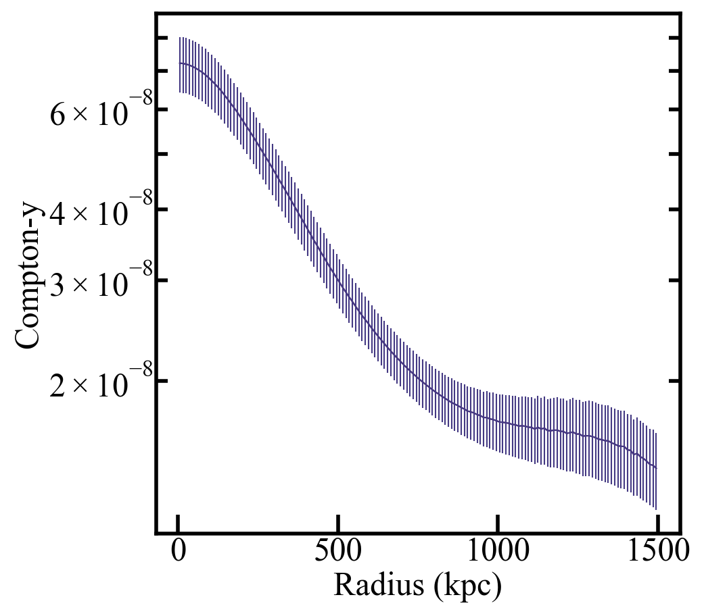
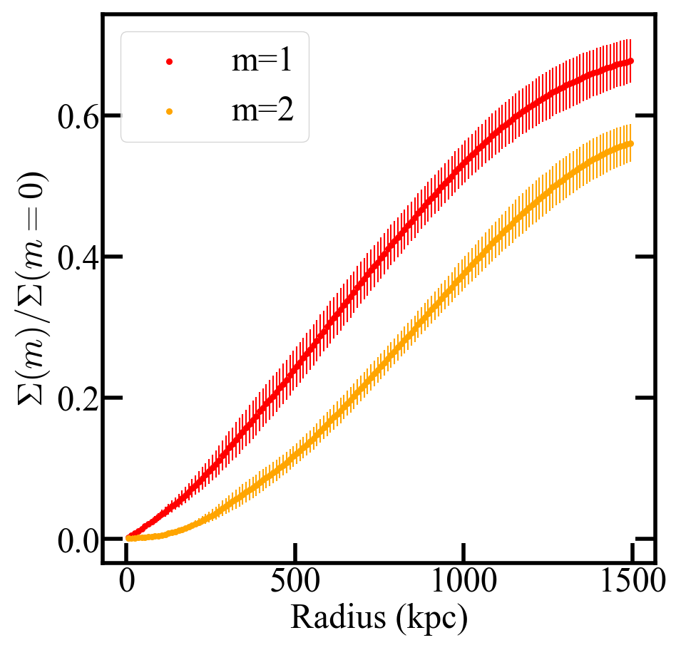
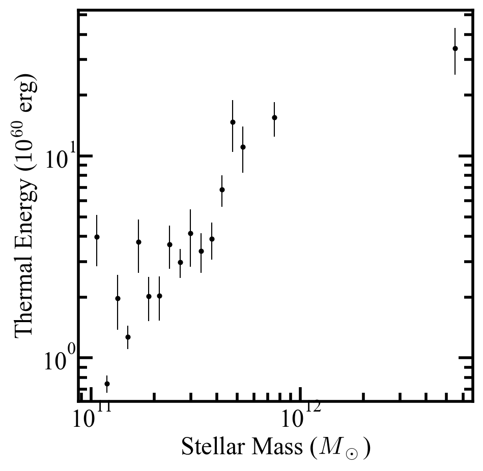
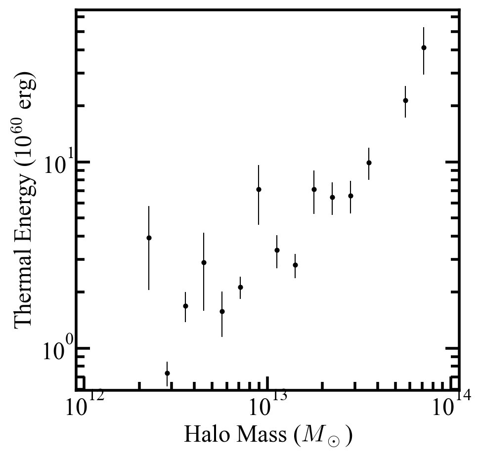
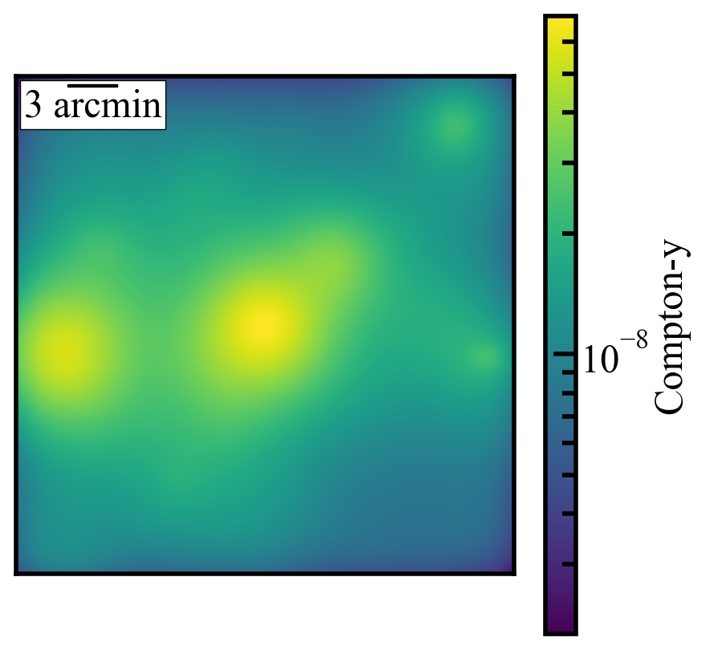

Loading and Plotting Thermal Sunyaev Zel'dovich Data
======================================================

This cookbook assumes you've already ran the RAFIKI-CGM pipeline. If not, see :doc:`quickstart` for install and setup or :doc:`running` for a full config walkthrough.
Here we use the same ``quickstart_config.yaml`` from the Quickstart, which produces ``./outputs/quickstart_szdat.h5`` and ``./outputs/quickstart_xraydat.h5``.

The routine below is available for download as a Jupyter notebook (``Plotting_SZ_Results.ipynb``) in the examples directory on Github

.. note:: 
	The matching approach to galaxy sample selection includes random selection during the resampling process, so your results may be slightly different than the example shown here. 

.. code-block:: python

    import numpy as np
    from matplotlib import pyplot as plt    
    import h5py

    data_file = './outputs/quickstart_szdat.hdf5' #path to saved stacked radial data-should be the only thing you need to change

    #-------------RADIAL PROFILES-------------#
    with h5py.File(data_file, 'r') as f:
        x_a = f['radial_profile/radius'][:]
        y_a = f['radial_profile/compton-y'][:]
        err_a = f['radial_profile/error'][:]

    plt.plot(x_a,y_a)
    plt.errorbar(x_a,y_a, yerr=err_a)
    plt.xlabel('Radius (kpc)')
    plt.ylabel('Compton-y')
    plt.yscale('log')
    plt.show()

.. code-block:: python

    #-------------MOMENT PROFILES-------------#
    with h5py.File(data_file, 'r') as f:
        x_a = f['moment_profiles/radius'][:]
        y_a = f['moment_profiles/moment_1'][:]
        err_a = f['moment_profiles/m1_error'][:]
        y_b = f['moment_profiles/moment_2'][:]
        err_b = f['moment_profiles/m2_error'][:]

    plt.scatter(x_a, y_a,s=30,color = 'red',label = 'm=1')
    plt.errorbar(x_a, y_a,yerr = err_a,color = 'red',fmt ='none')
    plt.scatter(x_a, y_b,s=30,color = 'orange',label = 'm=2')
    plt.errorbar(x_a, y_b,yerr = err_b,color = 'orange',fmt ='none')
    plt.legend()
    plt.xlabel('Radius (kpc)')
    plt.ylabel('$\Sigma(m)/\Sigma(m=0$)')
    plt.show()

.. code-block:: python

    #-------------STELLAR MASS-THERMAL ENERGY-------------#
    with h5py.File(data_file, 'r') as f:
        x_a = f['thermal_energy/stellar_mass'][:]
        y_a = f['thermal_energy/thermal_stellar'][:]
        err_a = f['thermal_energy/thermal_stellar_error'][:]

        plt.scatter(x_a ,y_a, c = 'black',s=40)
        plt.errorbar(x_a,y_a, yerr=err_a, fmt='none', color = 'black')
        plt.yscale('log')
        plt.xscale('log')
        plt.xlabel('Stellar Mass ($M_\odot$)')
        plt.ylabel('Thermal Energy ($10^{60}$ erg)')
        plt.show()

.. code-block:: python

   #-------------HALO MASS-THERMAL ENERGY-------------#
    with h5py.File(data_file, 'r') as f:
        x_a = f['thermal_energy/halo_mass'][:]
        y_a = f['thermal_energy/thermal_halo'][:]
        err_a = f['thermal_energy/thermal_halo_error'][:]

        plt.scatter(x_a ,y_a, c = 'black',s=40)
        plt.errorbar(x_a,y_a, yerr=err_a, fmt='none', color = 'black')
        plt.yscale('log')
        plt.xscale('log')
        plt.xlabel('Halo Mass ($M_\odot$)')
        plt.ylabel('Thermal Energy ($10^{60}$ erg)')
        plt.savefig('quickstart_te_halo.png')
        plt.show()

.. code-block:: python

    #--------------STACKED IMAGE-------------#
    import matplotlib.colors as colors
    with h5py.File(data_file, 'r') as f:
        y_a = f['image/image_dat'][:]
    import matplotlib.colors as colors
    from mpl_toolkits.axes_grid1.anchored_artists import AnchoredSizeBar

    fig, ax = plt.subplots()

    plt.imshow(y_a, norm=colors.LogNorm(vmin=np.min(y_a), vmax=np.max(y_a)))
    plt.colorbar(label='Compton-y')
    ax.set_xticks([]) 
    ax.set_yticks([]) 
    ax.set_xlabel("")  
    ax.set_ylabel("")

    #Calculated pixel scale using default 1 pixel = 3 arcsec
    scalebar = AnchoredSizeBar(ax.transData,
                            60, '3 arcmin', 'upper left', 
                            pad=0.1,
                            color='black',
                            frameon=True,
                            size_vertical=3)

    ax.add_artist(scalebar)
    plt.show()

