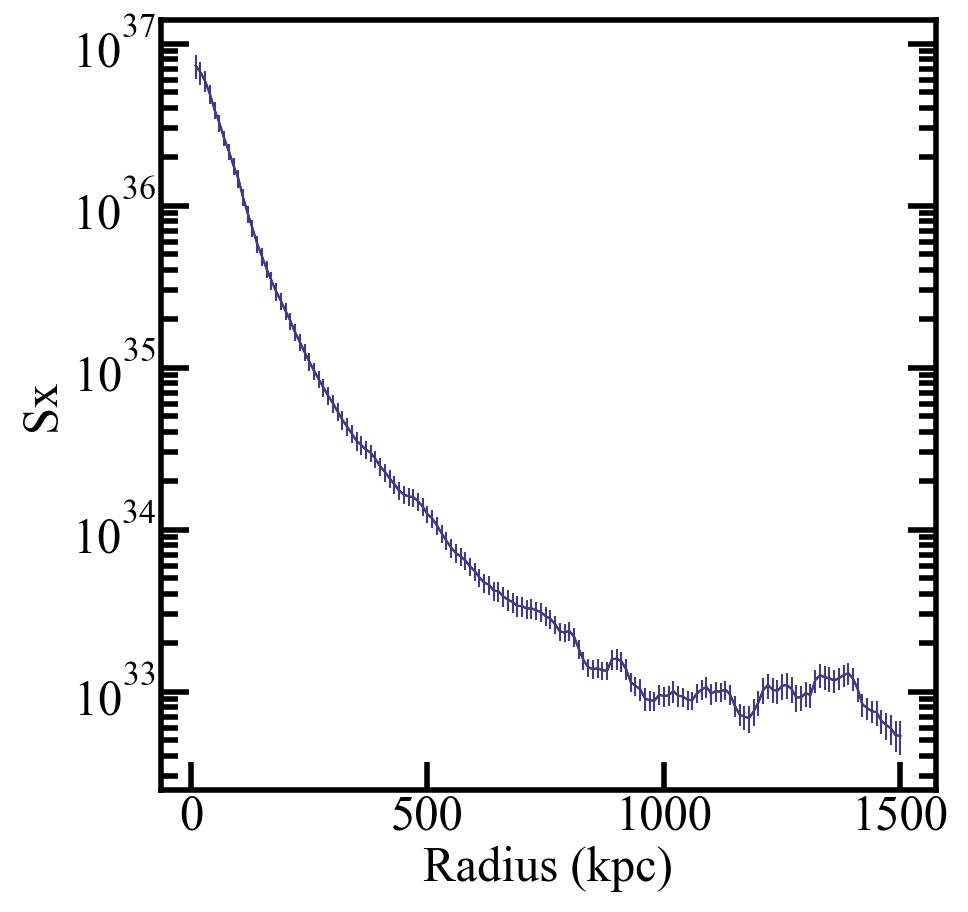
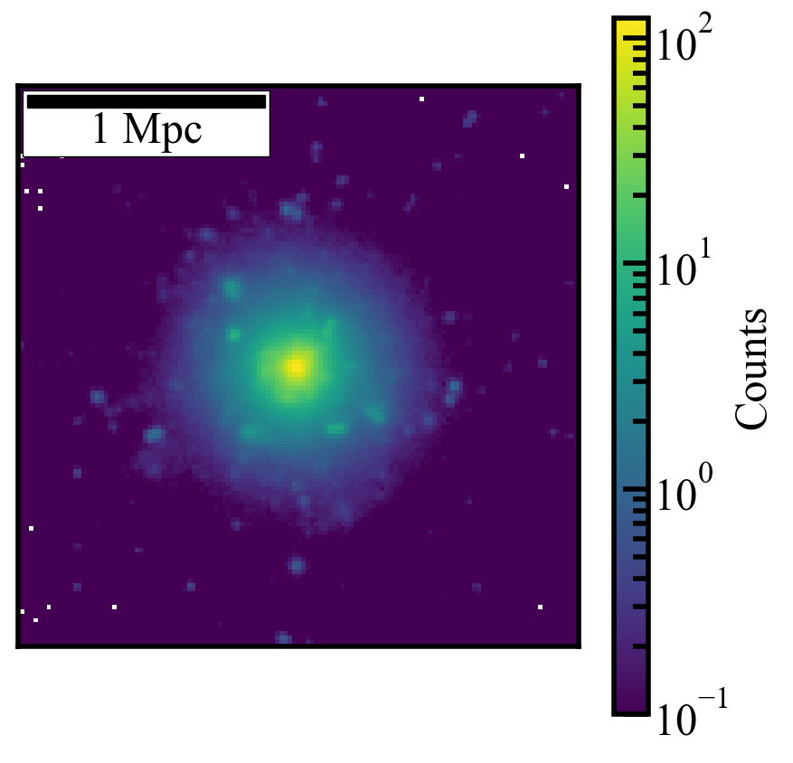

Loading and Plotting X-ray Data
================================
This cookbook assumes you've already ran the RAFIKI-CGM pipeline. If not, see :doc:`quickstart` for install and setup or :doc:`running` for a full config walkthrough.
Here we use the same ``quickstart_config.yaml`` from the Quickstart, which produces ``./outputs/quickstart_szdat.h5`` and ``./outputs/quickstart_xraydat.h5``.

The routine below is available for download as a Jupyter notebook (``Plotting_Xray_Results.ipynb``) in the examples directory on Github

.. note:: 
	The matching approach to galaxy sample selection includes random selection during the resampling process, so your results may be slightly different than the example shown here. 

.. code-block:: python

    import numpy as np
    from matplotlib import pyplot as plt    
    import h5py

    data_file = './outputs/quickstart_xraydat.hdf5' #path to saved stacked radial data-should be the only thing you need to change

    #-------------RADIAL PROFILES-------------#
    with h5py.File(data_file, 'r') as f:
        x_a = f['radial_profile/radius'][:]
        y_a = f['radial_profile/Sx'][:]
        err_a = f['radial_profile/error'][:]

    plt.plot(x_a[1:],y_a)
    plt.errorbar(x_a[1:],y_a, yerr=err_a)
    plt.xlabel('Radius (kpc)')
    plt.ylabel('Sx')
    plt.yscale('log')
    plt.show()

.. code-block:: python

    #----------------STACKED IMAGE-----------------#
    import matplotlib.colors as colors
    from mpl_toolkits.axes_grid1.anchored_artists import AnchoredSizeBar

    with h5py.File(data_file, 'r') as f:
        y_a = f['image/image_dat'][:]

    fig, ax = plt.subplots()
    y_a[y_a == 1e-8] = 1e-1
    plt.imshow(y_a, norm=colors.LogNorm(vmin=1e-1, vmax=np.max(y_a)))
    plt.colorbar(label='Counts')
    plt.xlim(384-384/6,384+384/6) #accounting for eROSITA image shape, might need to adjust if using another X-ray
    plt.ylim(384-384/6,384+384/6)

    scalebar = AnchoredSizeBar(ax.transData,
                            54.38, '1 Mpc', 'upper left', 
                            pad=0.1,
                            color='black',
                            frameon=True,
                            size_vertical=3)

    ax.add_artist(scalebar)
    ax.set_xticks([])  # Remove x ticks
    ax.set_yticks([])  # Remove y ticks
    ax.set_xlabel("")   # Remove x label
    ax.set_ylabel("")
    plt.savefig('quickstart_xraymap.png')

