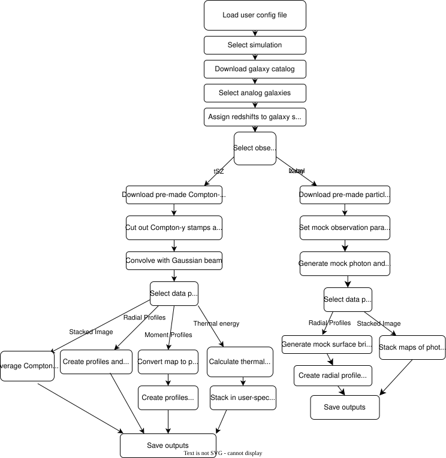

Overview
========
   
Why was RAFIKI-CGM Developed?
-----------------------------

Understanding how different physical processes such as AGN feedback shape galactic environments and diffuse gas is a key question of modern astrophysics.
Cosmological simulations provide a powerful tool for studying galactic evolution, as while they are calibrated to match global galaxy properties, they contain different models 
for baryonic processes that can lead to very different predictions for gas properties. Constraining these models and understanding the role feedback plays in galaxy evolution 
requires robust comparisons of simulations and observations. This is not a trivial process, but RAFIKI-CGM aims to make it as simple and robust as possible!

The hot gas phase of the circumgalactic medium is a useful place to look for fingerprints of feedback processes, but it is difficult to study due to its diffuse nature. There are two 
main probes of this hot gas: the thermal Sunyaev-Zel'dovich effect and soft X-ray emission. At halo masses below the cluster scale, both signals are only detectable via stacking methods. 
RAFIKI-CGM thus generates mock stacked data that can be compared against a range of observations.

RAFIKI-CGM uses data from 11 cosmological simulations with differing AGN feedback prescriptions to generate a large suite of possible comparisons. 
For more information on the simulations currently included, see :doc:`simulations`.

RAFIKI-CGM Pipeline
-------------------

RAFIKI-CGM consists of two distinct pipelines for generating mock tSZ and X-ray data. For ease of use, RAFIKI-CGM includes pre-made data products so that the user does not need 
to download the entire simulation snapshot.

The tSZ pipeline uses maps of the Compton-y parameeter for the full simulation volume, projected along each of the three simulation axes. During analysis, 
RAFIKI-CGM extracts stamps around selected galaxies and stacks them to create final mock-observables.

The X-ray pipeline instead uses precomputed particle catalogs containing the gas properties around the 500 most massive galaxies in each simulation box. 
Unlike the tSZ analysis, X-ray observations depend strongly on instrument sensitivites, exposure time, and redshift. Working directly from particle data allows for increased user-specified flexibility 
around these parameters throughout the entire forward modelling process. For the selected galaxies, particle data is passed through `pyXSIM <https://hea-www.cfa.harvard.edu/~jzuhone/pyxsim/index.html>`_ 
and `SOXS <https://hea-www.cfa.harvard.edu/soxs/>`_to produce mock X-ray observations.

To minimize download times and storage requirements, RAFIKI-CGM automatically downloads only the data products required for the selected simulation and galaxy sample, storing them in a user-specified directory.

The flowchart below shows the general steps taken when generating mock CGM data products in RAFIKI CGM. Purple
boxes indicate steps that require user specification in the YAML config file (see :doc:`running`).

RAFIKI-CGM Results
------------------

RAFIKI-CGM generates hdf5 files containing the following data:

Thermal SZ

* Stacked images of the Compton-y parameter 
* Radial profiles of the Compton-y parameter
* Moment profiles probing asymmetries in stacked data
* Mass: thermal energy scaling relations derived from Compton-y measurements 

Thermal X-ray Emission 

* Stacked images of X-ray photon counts
* Radial profiles of X-ray surface brightness

More detail on RAFIKI-CGM outputs can be found here: :doc:`outputs`

